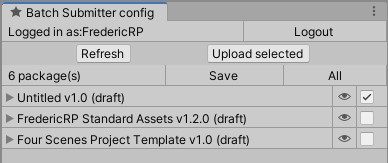

# Asset Store Batch Submitter

Easily upload new releases of your assets to the Unity Asset Store using this tool that allows to configure packages to upload and usable in batch mode.

An editor window smooths the onboarding.

I created this asset during my research on how to ease the publishing process, read my thinking process in the [Medium post](https://medium.com/p/1339880dd09f).

> **Disclaimer**: this asset uses undocumented APIs and Internal Editor APIs, it may breaks sometime, use at your own risks!
> **Thanksclaimer**: this asset development was way more easier thanks to the previous research of Michael 'Mikilo' Nguyen and Elmar 'RockTomate' that shared their work in the [Unity forum/snippet-how-to-upload-your-package-via-code](https://forum.unity.com/threads/snippet-how-to-upload-your-package-via-code.819858)

## Installation

Import the GiT package from the Unity Package Manager, using this Git repo like the following one:

> git@github.com:FredericRP/BatchSubmitter.git

## Usage

### In editor

Once this package has been installed, you can open the editor in the Window/FredericRP/BatchSubmitter menu item.

From this editor window, you can:
- login (then auto login by reusing the session created)
- logout
- refresh the package list retrieved from the Unity Asset Store
- select the packages you want to upload
- select the package root folder where to find the package assets
- hide the packages you don't want to see in the list (for instance: deprecated packages)

### In batch mode

Once this package installed, you can upload selected packages using the following command line

> Unity.exe -batchmode -projectPath "Drive:\Path\To\Project\Root" -executeMethod FredericRP.AssetStoreTools.BatchSubmitterClient.UploadPackages

